# Find_My_Pickle

## Our Goal
Do you love pickleball like me and have trouble finding courts near you. If so
we created the greatest app for you it is called Find My Pickle. Now you can find courts near you
based on your current location or the city name you enter.

## App Core functionality

### Find Courts Near You Based On Location
When a user presses the button they are able to see a list of courts near them. Searching courts based on location is done through the google maps places api.

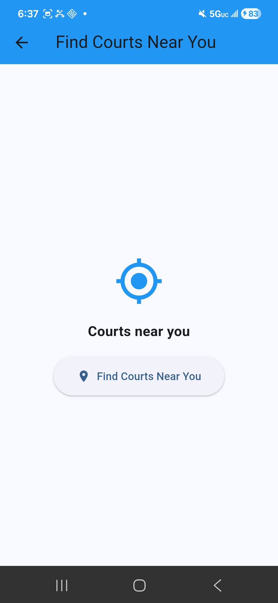

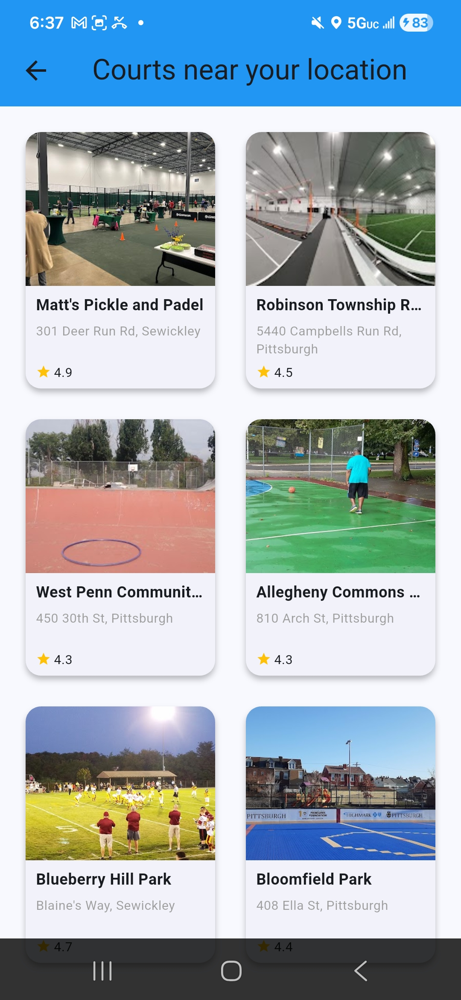

### Search for Courts In Your City
This allows users to enter a City and State and search for courts near them and a list of courts are displayed. Searching courts based on City and State is done through the google maps places api.

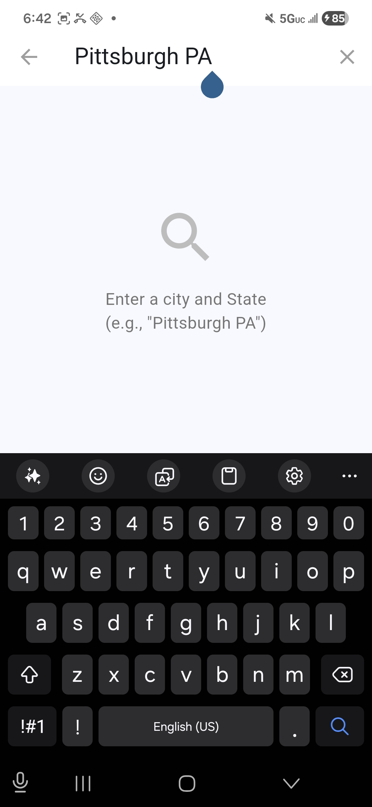

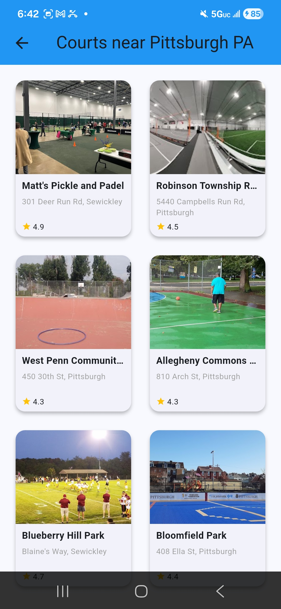

### Court Details
This has information about a particular court this includes:
• Court rating
• Court Address
• Directions button
• Share button
• Join a Game button

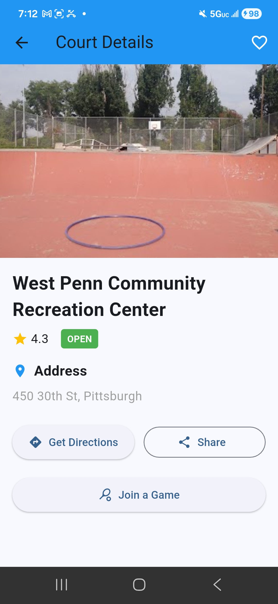

#### Get Directions button
This prompts the user to use location the first time and once the user accepts. It opens directions up in Google Maps or another maps
app of choice. If the user does not enter location, then when maps opens they have to enter the location manually.

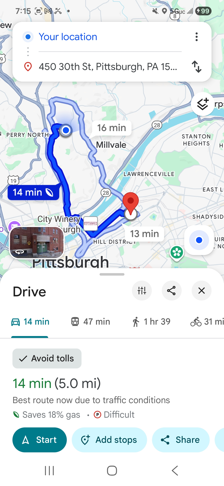

#### Share Button
This allows users to share the court details to others, via text, email, etc.

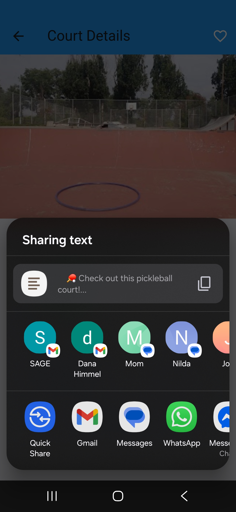

#### Join a Game Button
This allows a user to join or create a pickup game session at a particular pickleball court location. This is done using firebase database which maps users to a particular court.

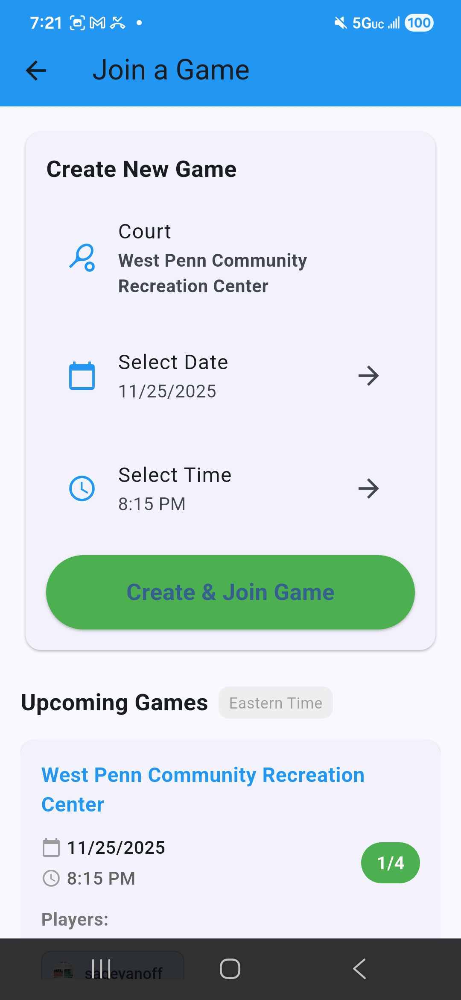

### Add Courts to Favorites
On the court details page the user can click the favorite icon to add a particular court to the favorites. 

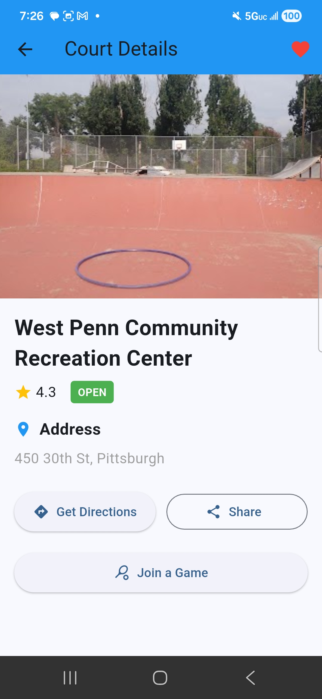

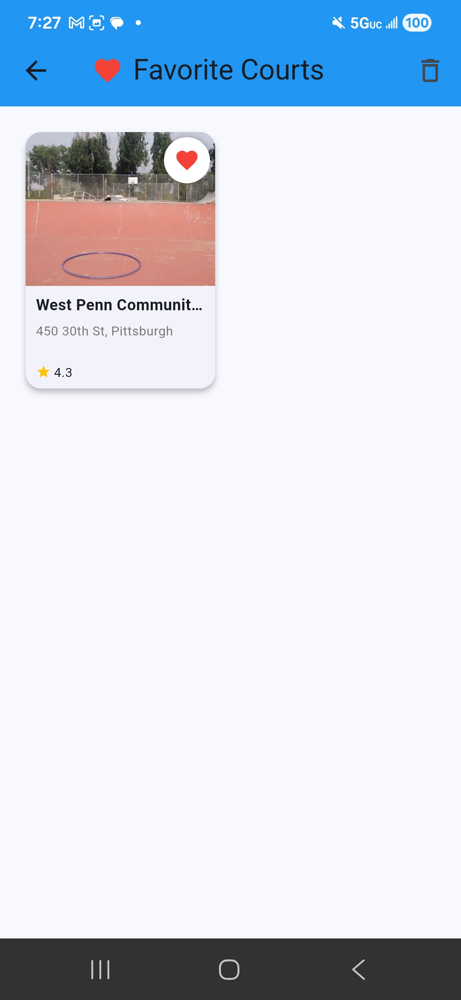

### Profile Picture
This allows users to add a photo to their profile which is distinctive when you are registered for a game. 
You have to be signed in, in order to add a picture to your profile. If you are signed in you can add a picture to your profile and this
is handled via firebase storage. 

## Login Services

### Create an account
This allows users to create an account to access some advanced features like adding a profile photo
and joining and creating pickup games. This account creation is handled via firebase authentication.

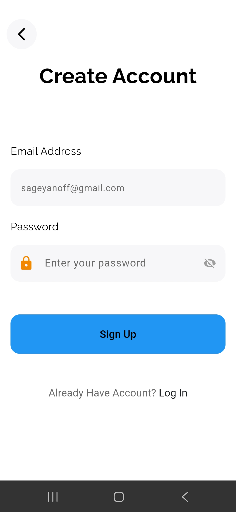

### Login 
This allows a user to login their account, this authentication is done using firebase authentication.

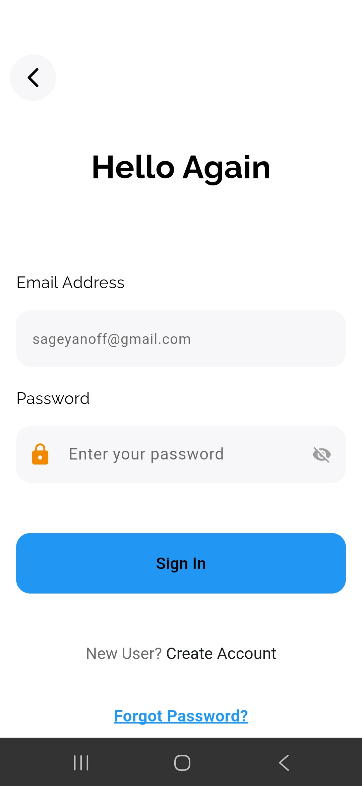

### Reset Password
This features sends a password reset email to the users email if the account exists. This is done through firebase authentication.
Just a note the password reset email gets sent to spam, which is because we do not currently have a domain set up for our app.

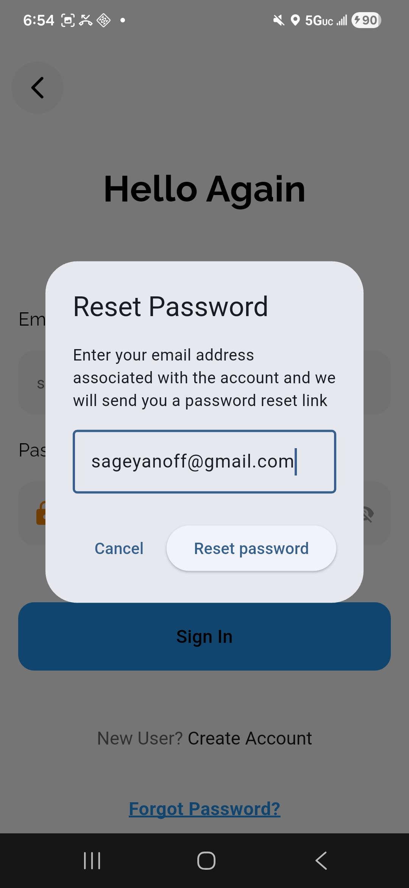

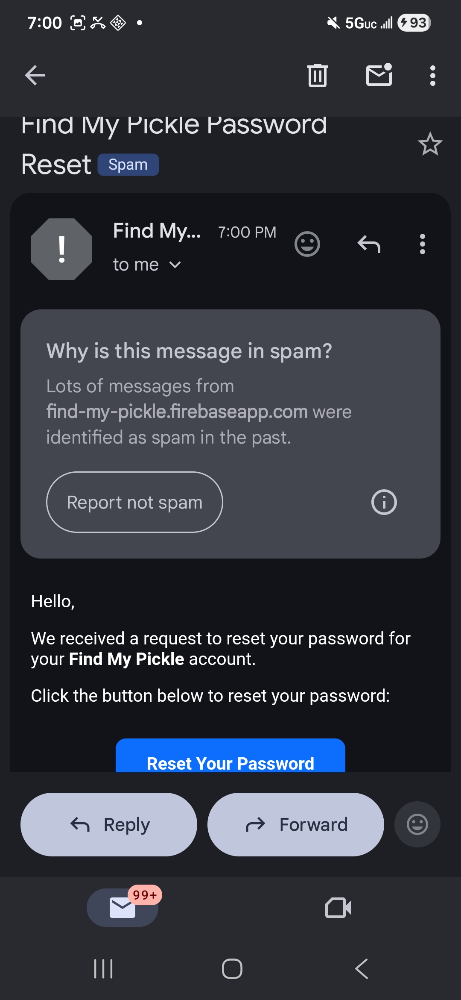

## Find a pickup game near you
Are you like me and have no friends and are looking for pickup games near you. With Find My Pickle you can signup for games 
at a particular court location and join other peoples games. Now you no longer have to play by your self and you can now play
the doubles games of your dreams.

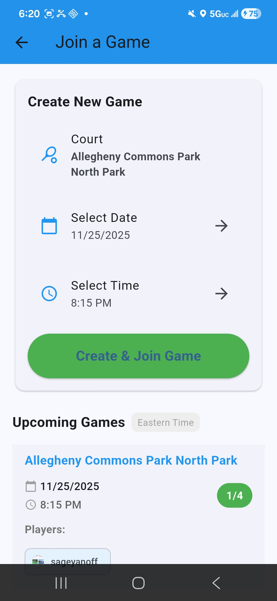

## App Walkthrough
Here is a link for the app Walkthrough video
https://photos.app.goo.gl/tdLvqAYpbbNfWEc5A

## MVVM Walkthrough video
Here is a link for the MVVM Overview
https://photos.app.goo.gl/qh6nteL3nUg9GAgy8

